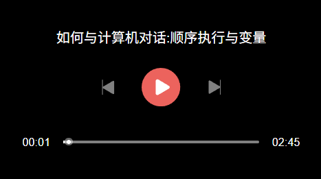

# sugar-player

这是一个基于video-js封装的音频播放器

## 安装

npm install sugar-player-js
<link rel="stylesheet" href="/dist/sugarPlayer.css"/>

## 使用

    const audio = "这里是音频地址"
    createPlayer('my-video', {
        title: '如何与计算机对话:顺序执行与变量',
        src: 'https://cdn.17video.net/UploadFiles/audio/F862D4E6BB.mp3',
        type: 'audio/mp3',
        state: {
            canNext: false, //这里传入左箭头的状态
            canPrev: false, //这里传入右箭头的状态
        },
        callback: {
            prev: () => {
                console.log("上一页") //这里点击左箭头时触发
            },
            next: () => {
                console.log("下一页") //这里点击右箭头时触发
            }
        }
    })

## 示例

